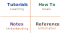

---
# Feel free to add content and custom Front Matter to this file.
# To modify the layout, see https://jekyllrb.com/docs/themes/#overriding-theme-defaults

layout: home
---

# Tools, Documentation and Libraries

This site hosts the common source of HowTo's for tools, equipment and other resources in the labs. It also links to datasheets and other components that you will see in various modules. 

Everything in here should be accessible in the engineering labs: or available at the Helpdesk. If in doubt, the Helpdesk is your first point of call for help.

## Documentation Structure

The documentation for this module is organised using the [Diátaxis](https://diataxis.fr/) documentation framework, to give four _types_ of documentation as summarised in @fig:DocStructure below. Structuring the documentation in this way is intended to help you find the most appropriate resources: both for the completing the module tasks and working your way through the topics we will cover. The different sections are also colour-coded to help orient you where you are, and organise your own notes.

{ #fig:DocStructure width=75% }

- All <strong style="color: #154889;">Tutorials </strong> have a series of _learning outcomes_, which will relate to the overall learning outcomes of the module. At the end of each [Workshops]{colour="blue"} you should have achieved a something that relates concretely to the overall topic and goal of the module. However the [Workshops]{colour="blue"} is also a _pathway_: you will begin with relatively little experience of the topic, idea, or skill. And should end with something to show that helps you to build your own understanding.

However a [Workshop]{colour="blue"} will not cover _everything_ you need to complete the module. Also, you will need other kinds of resources to help you complete the [Workshops]{colour="blue"}. Those other resources are

- [**How-To**]{colour="green"} guides can be found in most [Workshops]{colour="blue"}: they help you to achieve a specific _goal_, usually in a step-by-step manner. [How-To]{colour="green"} guides also do not give [Notes]{colour="violet"} explaining '_why_' things are done in a certain way, or provide a [Reference]{colour="brown"} to related material --- although they may link to these. Instead the aim of a [How-To]{colour="green"} guide is to answer questions as "_how do I do **x**?_" or "_what code should I use to achieve **y**_?

  Often a [Workshop]{colour="blue"} will introduce a specific [How-To]{colour="green"}: but it is up to you how much of it you use later. You may, for instance, choose to make you own notes of how to achieve a specific goal --- indeed these is strongly encouraged. Or you may find some [How-To]{colour="green"}'s setting up environment something you refer back to frequently.

- [**Notes**]{colour="violet"} provide the background '_why_' for a specific [How-To]{colour="green"} or [Workshop]{colour="blue"}. [Notes]{colour="violet"} should provide a deeper understanding of a topic: but they won't tell you '_how_' to do something. Most [Workshops]{colour="blue"} will have [**Notes**]{colour="violet"} giving the context, background, theory, or history of the topic being introduced in that activity. [Notes]{colour="violet"} will also link back to, or summarise, the content from lectures or other material to help you gain a full understanding of the module content.

- Finally, [**Reference**]{colour="brown"} material provides the basic facts you will need in other activities. Examples of [Reference]{colour="brown"} material are links to the API or source code for a specific library, data-sheets for components or other devices, and papers and books from the academic literature expanding on a specific topic or area. This allows you explore the summary outlined in a [Note]{colour="violet"}: or to understand the specific technique introduced in a [How-To]{colour="green"} in more detail.

You will need different kinds of documentation at different times: and you may use some types of documentation more frequently. For instance we expect you will only go through each [Workshop]{colour="blue"} once --- but you may refer to the [How-To]{colour="green"} guides within the [Workshops]{colour="blue"} more frequently. So we have also collected the various types of documentation together, to make it easier to go back to a specific piece of material more easily. If you can't find something, though, ask your module tutor for help.
